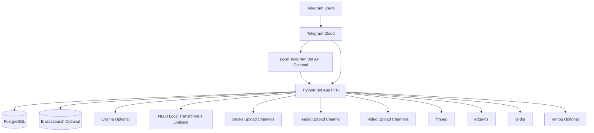

# SmartAIToolsBot

SmartAIToolsBot is a menu-first Telegram bot that combines a digital library, movie lookup, audiobook flow, AI utilities, media tools, and admin operations in one backend.

## 1. Backend Architecture

### 1.1 High-level topology



### 1.2 Runtime model

- Bot runtime: `python-telegram-bot` polling application.
- Startup behavior:
  - Initializes DB pool and schema.
  - Checks optional Elasticsearch connectivity.
  - Registers handlers and callback routes.
  - Syncs unindexed books/movies from DB to ES.
  - Applies command scopes per chat type and language.
- Single instance protection:
  - A lock file is used to avoid duplicate long-polling instances.
- Production orchestration:
  - `SmartAIToolsBot-stack.target` runs local Bot API, main bot, and dashboard service together.

### 1.3 Core backend services

- Source of truth: PostgreSQL.
- Search accelerator: Elasticsearch (`books` + `movies` indices).
- AI backends:
  - Ollama for chat/grammar/email/parts of AI tooling.
  - NLLB (Transformers) for translator backend.
  - Hybrid translator mode (NLLB + optional Ollama recheck).
- Media tools:
  - `ffmpeg` for audio/sticker/video conversions.
  - `edge-tts` for natural TTS.
  - `rembg` optional for sticker background removal.

### 1.4 Schema migrations (Alembic)

- Alembic config is included in `alembic.ini` and `alembic/`.
- Migration environment resolves DB connection from:
  - `DATABASE_URL`, or
  - `DB_NAME`, `DB_USER`, `DB_PASS`, `DB_HOST`, `DB_PORT`.
- Initial migration:
  - `20260309_0001_admin_task_runs` creates persisted admin task history table + indexes.
- Typical commands:
  - `alembic upgrade head`
  - `alembic current`
  - `alembic history`

## 2. Feature Catalog

| Feature | Status | Backend |
|---|---|---|
| Book search + delivery | Active | PostgreSQL + Elasticsearch optional |
| Movie search + delivery | Active | PostgreSQL + Elasticsearch optional |
| Audiobook parts per book | Active | PostgreSQL + Telegram channel storage |
| Upload books | Active | Telegram + PostgreSQL + ES async indexing |
| Upload movies | Active | Telegram + PostgreSQL + ES async indexing |
| Favorites / reactions / top lists | Active | PostgreSQL analytics tables |
| AI Chat | Active | Ollama |
| AI Translator | Active | Hybrid/NLLB/Ollama |
| AI Grammar Fix | Active | Ollama |
| AI Email Writer | Active | Ollama |
| AI Quiz Generator | Active | Ollama + quiz persistence |
| AI Music Generator | Active | local flow in AI module |
| AI PDF Maker | Active | reportlab + optional Ollama style logic |
| AI PDF Translator | Active | pdf_editor + AI translator backend |
| Text to Voice | Active | edge-tts + ffmpeg + optional Ollama polish |
| Audio Editor | Active | ffmpeg |
| PDF Editor | Active | pypdf/reportlab + OCR path |
| Sticker Tools | Active | ffmpeg + optional rembg |
| Video downloader (YouTube/Instagram) | Active (beta limits) | yt-dlp + ffmpeg |
| Name meanings | Coming soon scaffold | DB schema ready + menu placeholder |

## 3. Update Handling Flow

1. Telegram update arrives (message/callback/command).
2. Global guards run first:
   - paused guard
   - anti-spam guard
   - blocked/stopped checks
3. Routed by handler type:
   - Command handlers
   - Callback query handlers
   - Text message routing (`search_books` pipeline + mode handlers)
4. Operations execute using DB-first persistence.
5. Heavy work is offloaded with background tasks where appropriate (indexing, cleanup, async jobs).

## 4. Menu UX Architecture

### 4.1 Main Menu

- `🔎 Search Books`
- `🎬 Search Movies`
- `🤖 AI Tools`
- `🎙️ Text to Voice`
- `⬇️ Insta Youtub`
- `🌙 Ramadan Duas`
- `🛠️ Other Functions`
- `🛠 Admin Control` (admin/owner only)

### 4.2 AI Tools Menu

- `💬 Chat with AI`
- `🌐 AI Translator`
- `✍️ AI Grammar Fix`
- `📧 AI Email Writer`
- `📝 AI Quiz Generator`
- `🎵 AI Music Generator`
- `🤖 AI PDF Maker`
- `🌐📄 AI PDF Translator`

### 4.3 Other Functions Menu

- `🔥 Top Books`
- `🏆 Top Users`
- `🎛️ Audio Editor`
- `🧰 PDF Editor`
- `🧩 Sticker Tools`
- `🪪 Name Meanings` (coming soon)
- `📞 Contact Admin`
- `❓ Help`

Notes:
- `My Profile`, `Favorites`, `Request Book` are command-menu based now.
- Upload actions are command-based (`/upload`, `/movie_upload`).

## 5. Complete Command Reference

The bot registers 35 command handlers.

### 5.1 Private user command menu (default scope)

These are shown to normal users in private chats via command scopes:

- `/start`
- `/language`
- `/myprofile`
- `/favorite`
- `/request`
- `/requests`
- `/my_quiz`

### 5.2 Public commands callable but hidden from default command menu

These commands are implemented and available, but intentionally not shown in the default user command list:

| Command | Purpose | Access check |
|---|---|---|
| `/help` | Full usage guide | Public |
| `/pdf_maker` | AI PDF Maker wizard | Public |
| `/pdf_editor` | PDF editor session | Public |
| `/text_to_voice` | TTS wizard | Public |
| `/sticker_tools` | Sticker tools session | Public |
| `/top` | Top books | Public |
| `/top_users` | Top users | Public |
| `/mystats` | Personal stats | Public |
| `/movie_upload` | Enter movie upload mode | `is_allowed(user_id)` required for activation |

### 5.3 Group command scopes

- Group (all users) scope command list:
  - `/start`
  - `/language`
- Group admins scope command list:
  - `/group_read_start`
  - `/group_read_status`
  - `/group_read_end`

Group-reading command behavior:
- `/group_read_start`: group-only + group-admin required.
- `/group_read_status`: group-only, no admin required.
- `/group_read_end`: group-only + group-admin required.

### 5.4 Admin/operator commands

| Command | Purpose | Effective access |
|---|---|---|
| `/upload` | Book upload mode | Owner-only (`_is_admin_user` maps to owner) |
| `/admin` | Admin control panel | Owner-only |
| `/smoke` | Smoke checklist | Owner-only |
| `/db_dupes` | DB duplicate cleanup preview/task | Owner-only |
| `/es_dupes` | ES duplicate cleanup preview/task | Owner-only |
| `/dupes_status` | Duplicate cleanup status | Owner-only |
| `/cancel_task` | Cancel background task | Owner-only |
| `/user` | User search/admin actions | Owner-only |
| `/pause_bot` | Pause public interactions | Owner-only |
| `/resume_bot` | Resume public interactions | Owner-only |
| `/upload_local_books` | Local bulk upload job | Owner-only |
| `/broadcast` | Broadcast message to all users | Owner-only |
| `/audit` | Audit/metrics report | Owner-only |
| `/prune` | Remove blocked/unreachable users | Owner-only |
| `/missing` | Missing-file preview/cleanup | Owner-only |

Important:
- Runtime authority is owner-only (`TELEGRAM_OWNER_ID`).
- `TELEGRAM_ADMIN_ID` remains as a legacy compatibility variable and is not used for command authorization.

## 6. Permissions and Rights Model

### 6.1 User state gates

Every major flow checks these states:

- `blocked` users are denied.
- `stopped` users are ignored.
- anti-spam cooldowns apply for high-frequency actions.

### 6.2 Role gates

- Admin user alias: `_is_admin_user(user_id)` (owner-only mapping).
- Owner user: `_is_owner_user(user_id)`.
- Group admin: `_is_group_admin_user()` for group-reading moderation commands.

### 6.3 Upload rights

- Book upload command (`/upload`) is owner-only.
- Movie upload command (`/movie_upload`) uses `is_allowed(user_id)` to activate mode.
- Unauthorized upload attempts trigger upload-help request flow.

### 6.4 Command scope delivery

Command menus are synced by scopes:

- `BotCommandScopeDefault`: minimal user menu in private chats.
- `BotCommandScopeAllGroupChats`: `/start`, `/language`.
- `BotCommandScopeAllChatAdministrators`: group reading commands.
- `BotCommandScopeChat(chat_id=...)`: admin/owner scoped command menu.

## 7. Search Architecture

### 7.1 Books

- Input text enters `search_books` pipeline.
- Query normalization + transliteration path.
- If ES available: `multi_match` fuzzy search on `book_name`, `display_name`.
- If ES unavailable: DB/local fallback search.
- Results are deduplicated by stable UUID and paginated via inline buttons.
- Not-found path offers request creation with callback button.

### 7.2 Movies

- Movie mode is toggled by `Search Movies` menu action.
- Search uses normalized/transliterated query.
- ES movie index preferred with weighted fields:
  - `movie_name`, `display_name`, `search_text`, `genre`, `movie_lang`, `country`, `rating`, `release_year_text`, `caption_text`.
- DB fallback is used when ES is unavailable or has no hits.
- Results are paginated and selected similarly to books.

### 7.3 Group behavior

- In groups, book search is reply-driven to avoid noise.
- The bot ignores normal group text unless it is a reply to bot message.

## 8. Upload and Indexing Architecture

### 8.1 Book uploads

- Activation: `/upload` (admin-only wrapper).
- Media ingestion writes to DB first.
- User feedback is final-state oriented (`Saved`/`Duplicate`) without extra index spam.
- ES indexing is asynchronous through queue worker:
  - flush by batch size (`UPLOAD_ES_BULK_SIZE`)
  - flush by idle timeout (`UPLOAD_ES_BULK_IDLE_TIMEOUT_SEC`)

### 8.2 Movie uploads

- Activation: `/movie_upload` (allowed users).
- Supports video/document/animation sources.
- Parses caption metadata (title/year/genre/language/country/rating) with multilingual patterns.
- Stores canonical movie record in DB and indexes in ES.
- Requires `VIDEO_UPLOAD_CHANNEL_IDS` (recommended, comma-separated) or legacy `VIDEO_UPLOAD_CHANNEL_ID`.

### 8.3 Audiobooks

- Audiobook parts are stored in `audio_book_parts` with optional channel pointers.
- Per-book audiobook add/listen/delete operations are callback-driven.
- Owner/admin can see moderation controls (including request counters where applicable).

### 8.4 Startup sync jobs

On startup:

- `sync_unindexed_books()`
- `sync_unindexed_movies()`

These backfill ES for items saved in DB but not indexed yet.

## 9. AI and Media Backend Details

### 9.1 AI Translator backend modes

`AI_TRANSLATOR_BACKEND` supports:

- `hybrid` (default): NLLB primary + optional Ollama recheck/fallback.
- `nllb`: local NLLB only (with optional fallback if enabled).
- `ollama`: Ollama-only translation.

Hybrid controls:

- `AI_TRANSLATOR_FALLBACK_OLLAMA`
- `AI_TRANSLATOR_HYBRID_RECHECK_ALWAYS`

### 9.2 Text to Voice

- Wizard-based session with voice/gender/tone/speed/output mode.
- Uses `ffmpeg` plus backend fallback (`edge-tts` first, `espeak-ng` if available).
- Optional Ollama polishing can refine input text before synthesis.
- Long text is chunked automatically and merged into one final voice/audio file.
- Final audio is post-processed with ffmpeg filters and cached in memory for repeat requests.

### 9.3 Audio Editor

- Converts between voice and MP3.
- Supports cut ranges using `mm:ss-mm:ss` style.
- Supports rename.
- Supports MP3 cover attachment (`ffmpeg`).
- Final `Complete` action sends transformed output.

### 9.4 PDF Editor / AI PDF Translator

Editor operations include:

- Compress PDF
- OCR extraction
- Export to TXT
- Export to EPUB
- Watermark
- AI translation for supported file types (`.pdf`, `.epub`, `.docx`, `.doc`, `.txt`, `.md`, `.markdown`)

### 9.5 Sticker Tools

- Static sticker conversion
- Video sticker conversion
- Background removal (`rembg`, optional)

### 9.6 Video Downloader (beta)

- Supports public YouTube and Instagram URLs.
- Quality picker with preview card.
- `VIDEO_DL_MAX_MB` hard-capped to 15 MB in current logic.
- Current per-user test quota: 3 successful downloads.

## 10. Data Architecture (PostgreSQL + Elasticsearch)

### 10.1 PostgreSQL tables (complete)

| Table | Purpose | Key fields |
|---|---|---|
| `schema_migrations` | schema version history | `version`, `applied_at` |
| `users` | user identity + state | `id`, `blocked`, `allowed`, `language` |
| `removed_users` | removed/blocked archive | user identity snapshot + `removed_at` |
| `books` | canonical book records | `id`, `book_name`, `file_id`, `path`, `indexed`, `downloads`, `searches` |
| `movies` | canonical movie records | `id`, `movie_name`, media fields, metadata, `indexed` |
| `audio_books` | audiobook root per book | `id`, `book_id`, `part_count`, counters |
| `audio_book_parts` | audiobook parts/media pointers | `audio_book_id`, `file_id`, `channel_id`, `channel_message_id` |
| `upload_receipts` | upload pipeline state tracking | `status`, `saved_to_db`, `saved_to_es`, timestamps |
| `book_requests` | user book requests lifecycle | `query`, `status`, admin-note fields |
| `upload_requests` | user upload-access requests | `status`, admin-note fields |
| `book_reactions` | per-user book reactions | `book_id`, `user_id`, `reaction` |
| `user_favorites` | favorite books | `user_id`, `book_id`, `ts` |
| `user_favorite_awards` | favorite reward tracking | `user_id`, `book_id` |
| `user_reaction_awards` | reaction reward tracking | `user_id`, `book_id` |
| `user_recents` | recent interactions | `user_id`, `book_id`, `ts` |
| `user_quizzes` | saved/generated quizzes | `user_id`, `questions_json`, `share_count` |
| `book_summaries` | generated summaries cache | `book_id`, `lang`, `mode`, `summary_text` |
| `analytics_daily` | daily totals | `day`, `searches`, `buttons` |
| `analytics_daily_users` | per-user daily totals | `day`, `user_id`, counters |
| `analytics_counters` | lifetime counters | `key`, `value` |
| `name_meanings` | future feature scaffold | multilingual name/meaning/origin fields |

### 10.2 Elasticsearch indexes

- `books` index: search acceleration for books.
- `movies` index: search acceleration for movies (`MOVIES_ES_INDEX`, default `movies`).

PostgreSQL remains source of truth; ES is derivative and rebuildable.

## 11. Module Map

| Module | Responsibility |
|---|---|
| `bot.py` | bootstrap, handler registration, shared bridges, startup orchestration |
| `config.py` | `.env` loading and core IDs/channels |
| `db.py` | schema + all DB operations |
| `command_sync.py` | per-scope Telegram command synchronization |
| `menus.py` | reply keyboard layouts |
| `menu_ui.py` | menu text parsing, help text, admin labels |
| `search_flow.py` | text search pipeline, book/movie pagination, audiobook callbacks |
| `upload_flow.py` | upload modes, file ingestion, ES queue worker |
| `admin_tools.py` | admin menu action dispatch + prompt handling |
| `admin_runtime.py` | admin commands, tasks, duplicate cleanup, local bulk upload |
| `user_interactions.py` | requests, profile, favorites, user callbacks |
| `engagement_handlers.py` | top lists, favorites, reactions, summaries |
| `ai_tools.py` | AI chat/translator/grammar/email/quiz/music/image placeholders |
| `pdf_maker.py` | text-to-PDF wizard |
| `pdf_editor.py` | PDF/file editor + AI translator flow |
| `audio_converter.py` | audio edit/convert/cut/cover flow |
| `tts_tools.py` | TTS wizard and generation |
| `sticker_tools.py` | sticker conversion + optional bg removal |
| `video_downloader.py` | YouTube/Instagram downloader flow |

## 12. Environment Variables

## 12.1 Required

- `TELEGRAM_BOT_TOKEN`
- `TELEGRAM_OWNER_ID`
- `DB_NAME`
- `DB_USER`
- `DB_PASS`
- `DB_HOST`
- `DB_PORT`

## 12.2 Core optional

- `TELEGRAM_ADMIN_ID` (legacy compatibility only, not used for auth)
- `REQUEST_CHAT_ID`
- `UPLOAD_CHANNEL_ID`
- `UPLOAD_CHANNEL_IDS` (comma-separated)
- `AUDIO_UPLOAD_CHANNEL_IDS` (comma-separated, recommended for round-robin audiobook storage)
- `AUDIO_UPLOAD_CHANNEL_ID`
- `VIDEO_UPLOAD_CHANNEL_IDS` (comma-separated, recommended for round-robin movie storage)
- `VIDEO_UPLOAD_CHANNEL_ID`
- `MOVIES_ES_INDEX` (default `movies`)

## 12.3 Upload tuning

- `UPLOAD_NO_STATUS_EDITS`
- `UPLOAD_ES_BULK_SIZE`
- `UPLOAD_ES_BULK_IDLE_TIMEOUT_SEC`
- `UPLOAD_SKIP_NAME_DUP_CHECK`
- `UPLOAD_SKIP_REQUEST_NOTIFY`
- `UPLOAD_FANOUT_RETRY_MAX`
- `UPLOAD_FANOUT_SEND_DELAY_SEC`
- `UPLOAD_FANOUT_RETRY_JITTER_SEC`

## 12.4 Self-hosted Telegram Bot API (optional)

- `TELEGRAM_BOT_API_BASE_URL`
- `TELEGRAM_BOT_API_BASE_FILE_URL`
- `TELEGRAM_BOT_API_LOCAL_MODE`

## 12.5 Search / Elasticsearch

- `ES_URL`
- `ES_USER`
- `ES_PASS`
- `ES_CA_CERT`

## 12.6 Coins / rankings

- `COIN_SEARCH`
- `COIN_DOWNLOAD`
- `COIN_REACTION`
- `COIN_FAVORITE`
- `COIN_REFERRAL`
- `TOP_USERS_LIMIT`

## 12.7 Ollama and AI tools

- `OLLAMA_URL`
- `AI_CHAT_OLLAMA_MODEL`
- `AI_CHAT_OLLAMA_TIMEOUT`
- `AI_TOOLS_OLLAMA_TIMEOUT`
- `TTS_BACKENDS`
- `TTS_MAX_INPUT_CHARS`
- `TTS_CHUNK_MAX_CHARS`
- `TTS_CACHE_TTL_S`
- `TTS_CACHE_MAX_ENTRIES`
- `TTS_FFMPEG_TIMEOUT_S`
- `TTS_VOICE_OPUS_BITRATE`
- `TTS_AUDIO_MP3_QUALITY`
- `TTS_AUDIO_FILTERS`
- `TTS_OLLAMA_MODEL`
- `TTS_OLLAMA_TIMEOUT`
- `PDF_MAKER_OLLAMA_MODEL`
- `PDF_MAKER_OLLAMA_TIMEOUT`

## 12.8 AI translator (NLLB / hybrid)

- `AI_TRANSLATOR_BACKEND` (`hybrid`, `nllb`, `ollama`)
- `AI_TRANSLATOR_NLLB_MODEL`
- `AI_TRANSLATOR_NLLB_DEVICE`
- `AI_TRANSLATOR_NLLB_LOCAL_ONLY`
- `AI_TRANSLATOR_NLLB_MAX_INPUT_TOKENS`
- `AI_TRANSLATOR_NLLB_MAX_NEW_TOKENS`
- `AI_TRANSLATOR_FALLBACK_OLLAMA`
- `AI_TRANSLATOR_HYBRID_RECHECK_ALWAYS`

## 12.9 Video downloader

- `VIDEO_DL_MAX_MB` (currently capped to 15 MB in code)

## 12.10 Runtime reliability

- `DB_RUNTIME_SCHEMA_MODE` (`auto`, `always`, `never`)
- `DROP_PENDING_UPDATES` (`0`/`1`)
- `ERROR_LOG_MAX_MB`
- `ERROR_LOG_BACKUP_COUNT`

## 13. Setup and Run

### 13.1 Manual run

```bash
cd ~/Documents/SmartAIToolsBot
python3 -m venv venv312
source venv312/bin/activate
pip install -r requirements.txt
python3 -m alembic upgrade head
python3 bot.py
```

### 13.2 Optional dependencies by feature

```bash
# PDF/TTS/Translator extras
pip install reportlab pypdf edge-tts transliterate torch transformers sentencepiece safetensors

# Sticker background remove
pip install rembg
```

System packages often needed:

- `ffmpeg`
- for `.doc` extraction in PDF translator/editor: `antiword` or `catdoc`

## 14. systemd Production Setup

Recommended services:

- `SmartAIToolsBot.service` (local Telegram Bot API)
- `SmartAIToolsBot-bot.service` (main bot)
- `SmartAIToolsBot-dashboard.service` (local web dashboard)
- `SmartAIToolsBot-stack.target` (full stack target)

Common commands:

```bash
sudo systemctl enable --now SmartAIToolsBot-stack.target
sudo systemctl restart SmartAIToolsBot-stack.target
sudo systemctl status SmartAIToolsBot-stack.target SmartAIToolsBot.service SmartAIToolsBot-bot.service SmartAIToolsBot-dashboard.service --no-pager
sudo journalctl -fu SmartAIToolsBot.service -fu SmartAIToolsBot-bot.service -fu SmartAIToolsBot-dashboard.service -l
```

Wi-Fi dispatcher integration:

```bash
sudo install -m 0755 systemd/SmartAIToolsBot-nm-dispatcher.sh /etc/NetworkManager/dispatcher.d/90-smartaitoolsbot
sudo systemctl enable --now NetworkManager-dispatcher.service
sudo journalctl -t smartaitoolsbot-dispatcher -f -l
```

## 15. Live Logs and Diagnostics

Bot logs:

```bash
sudo journalctl -u SmartAIToolsBot-bot.service -f -o short-precise
```

Stack logs:

```bash
sudo journalctl -fu SmartAIToolsBot.service -fu SmartAIToolsBot-bot.service -fu SmartAIToolsBot-dashboard.service -l
```

Quick command scope sanity check (admin/private/group):

```bash
python3 - <<'PY'
from command_sync import get_public_commands_for_menu, get_group_commands, get_group_admin_commands, get_admin_commands
print('public:', [c.command for c in get_public_commands_for_menu('en')])
print('group:', [c.command for c in get_group_commands('en')])
print('group_admin:', [c.command for c in get_group_admin_commands('en')])
print('admin:', [c.command for c in get_admin_commands('en')])
PY
```

## 16. Troubleshooting

### 16.1 Conflict: terminated by other getUpdates request

Cause: multiple bot instances with same token.

Check:

```bash
ps -ef | grep '[p]ython.*bot.py'
sudo systemctl status SmartAIToolsBot-bot.service
```

### 16.2 Service works manually but not in systemd

Check `ExecStart` python path and `EnvironmentFile`:

```bash
sudo systemctl cat SmartAIToolsBot-bot.service
```

### 16.3 Unit is masked

```bash
sudo systemctl unmask SmartAIToolsBot.service SmartAIToolsBot-bot.service SmartAIToolsBot-dashboard.service
sudo systemctl daemon-reload
sudo systemctl restart SmartAIToolsBot-stack.target
```

### 16.4 Upload appears stuck at loading

- Set `UPLOAD_NO_STATUS_EDITS=1`.
- Watch logs while uploading:

```bash
sudo journalctl -u SmartAIToolsBot-bot.service -f -l
```

### 16.5 Reactions do not appear

If `setMessageReaction` is unsupported by your local Bot API server version, reactions may silently fallback.

### 16.6 Movie upload says VIDEO_UPLOAD_CHANNEL_IDS/VIDEO_UPLOAD_CHANNEL_ID not configured

Set `VIDEO_UPLOAD_CHANNEL_IDS` in `.env` (comma-separated) or legacy `VIDEO_UPLOAD_CHANNEL_ID`, ensure bot is admin in each channel, then restart service.

## 17. Security Notes

- Never commit `.env`.
- Keep DB/ES credentials private.
- Restrict admin IDs to trusted operators.
- Prefer localhost binding for internal services.

## 18. Current Status

The codebase is modular and production-usable for current features, with active development on additional AI/media capabilities and quality improvements.
